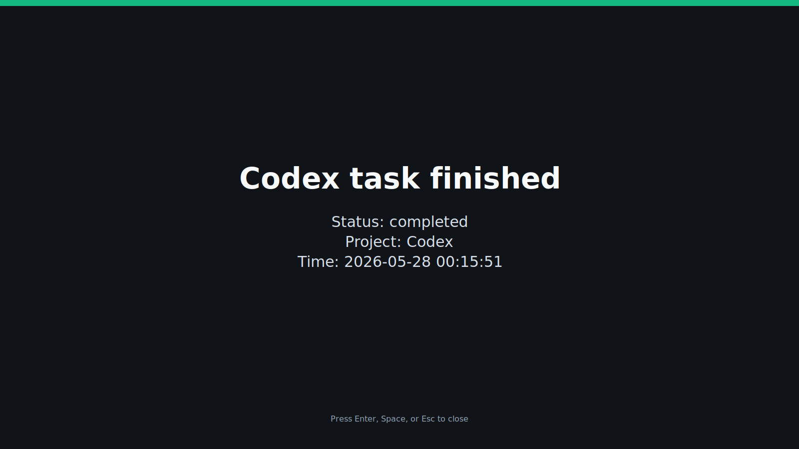

# Codex Knock

[English](#codex-knock) | [简体中文](#简体中文)

Local-first phone notifications for Codex task completion.

Codex Knock is a tiny CLI that receives a Codex notification event and forwards a privacy-safe alert to your phone or desktop. It starts with one job: let me know when Codex is done, failed, or waiting for approval.

It is not a desktop pet. It is a minimal Codex notification bridge: it only appears when Codex finishes, fails, or needs your attention.

It does not require GitHub, a hosted backend, or any Python dependencies.

## Why

Long AI coding runs are perfect attention traps. You switch away for "just a minute", open a video, check a message, and suddenly the task finished quietly twenty minutes ago.

Codex Knock is the little knock on the door that brings you back at the right moment. It stays out of the way while Codex works, then shows a clear desktop alert or sends a phone notification when your attention is actually needed.

## Preview



## Current Status

`v0.1.1` is a desktop-popup-first MVP.

- Default and locally verified: full-screen `desktop` popup
- Implemented adapters: `ntfy`, `Bark`, `PushDeer`, `WxPusher`, Enterprise WeChat (`wecom`)
- Not included yet: custom WeChat Mini Program, remote approval, hosted backend

The extra notification providers are available for early users who already have those channels configured. The desktop popup is the recommended first setup.

## What It Sends

By default, Codex Knock uses `privacy.mode = "minimal"` and sends only:

- status
- project name, if configured
- local time

It does not send prompts, source code, terminal output, or raw Codex event JSON unless you explicitly enable that.

## Supported Channels

- `stdout` for local dry runs
- `desktop` for a full-screen local popup
- `ntfy`
- `Bark`
- `PushDeer`
- `WxPusher`
- Enterprise WeChat group robot (`wecom`)

The simplest zero-account setup is `desktop`: Codex Knock opens a topmost local popup when Codex finishes. The simplest phone setup is usually `ntfy`: install the ntfy app on your phone, subscribe to a private topic, then set that topic locally.

## Install

From this folder:

```powershell
python -m pip install -e .
python -m codex_knock setup-desktop
```

`setup-desktop` creates the Codex Knock config and updates your Codex config with:

```toml
notify = ["python", "-m", "codex_knock", "notify"]
```

If your Codex config already exists, Codex Knock creates a timestamped backup before editing it.

Preview changes without writing files:

```powershell
python -m codex_knock setup-desktop --dry-run
```

On Windows the default config path is:

```text
%APPDATA%\codex-knock\config.toml
```

On macOS/Linux:

```text
~/.config/codex-knock/config.toml
```

## Configure Desktop Popup

The one-command setup above writes this full-screen desktop configuration for you:

```toml
[notify]
provider = "desktop"
project_name = "Codex"

[privacy]
mode = "minimal"

[providers.desktop]
fullscreen = true
auto_close_seconds = 0
```

Then test without sending anything over the network:

```powershell
python -m codex_knock test
```

The popup closes with Enter, Space, or Esc. Set `auto_close_seconds = 10` if you want it to disappear by itself.

## Configure ntfy

Edit the config file:

```toml
[notify]
provider = "ntfy"
project_name = "my-project"

[privacy]
mode = "minimal"

[providers.ntfy]
url = "https://ntfy.sh"
topic_env = "CODEX_NOCK_NTFY_TOPIC"
priority = "default"
```

Set the topic as a local environment variable:

```powershell
[Environment]::SetEnvironmentVariable("CODEX_NOCK_NTFY_TOPIC", "your-private-topic", "User")
```

Open a new terminal and test:

```powershell
python -m codex_knock test
```

Use `--dry-run` to print the notification instead of sending it:

```powershell
python -m codex_knock test --dry-run
```

## Connect Codex

`setup-desktop` handles this automatically. If you prefer to configure Codex manually, add this to the top level of your Codex config, before any `[section]` headers:

```toml
notify = ["python", "-m", "codex_knock", "notify"]
```

Codex Knock accepts event JSON as either a command argument or stdin, so it works with both common hook styles.

## Privacy Modes

```toml
[privacy]
mode = "minimal"
max_body_chars = 500
include_raw_event = false
```

Modes:

- `minimal`: status, project, time only
- `summary`: also includes a short redacted message/title/summary from the event
- `full`: may include raw event JSON only if `include_raw_event = true`

Keep `minimal` unless you are sure your push channel is private enough for your workflow.

## Other Providers

Bark:

```toml
[notify]
provider = "bark"

[providers.bark]
server = "https://api.day.app"
key_env = "CODEX_NOCK_BARK_KEY"
```

PushDeer:

```toml
[notify]
provider = "pushdeer"

[providers.pushdeer]
endpoint = "https://api2.pushdeer.com/message/push"
pushkey_env = "CODEX_NOCK_PUSHDEER_KEY"
```

WxPusher:

```toml
[notify]
provider = "wxpusher"

[providers.wxpusher]
endpoint = "https://wxpusher.zjiecode.com/api/send/message"
app_token_env = "CODEX_NOCK_WXPUSHER_APP_TOKEN"
uids_env = "CODEX_NOCK_WXPUSHER_UIDS"
```

Enterprise WeChat group robot:

```toml
[notify]
provider = "wecom"

[providers.wecom]
webhook_env = "CODEX_NOCK_WECOM_WEBHOOK"
```

Desktop popup:

```toml
[notify]
provider = "desktop"

[providers.desktop]
fullscreen = true
auto_close_seconds = 0
```

## Notes

Codex Knock is an unofficial tool and is not affiliated with or endorsed by OpenAI. The default desktop popup does not send prompts, code, or terminal output over the network.

If you enable third-party notification providers, review their privacy tradeoffs before use.

## Development

Run tests:

```powershell
python -m unittest discover
```

---

## 简体中文

[English](#codex-knock) | [简体中文](#简体中文)

Codex 任务完成提醒工具，默认本地优先、隐私最小化。

Codex Knock 是一个很小的命令行工具：它接收 Codex 的通知事件，然后把一条安全、简短的提醒发到你的桌面或手机。第一版只做一件事：Codex 跑完、失败或等待批准时提醒你。

它不是桌面宠物。它是一个极简 Codex 提醒桥：只有在 Codex 跑完、失败或需要你处理时才出现。

它不需要 GitHub、不需要自建后端，也没有任何 Python 第三方依赖。

## 为什么需要它

AI 编程任务一跑起来，很容易变成注意力陷阱。你只是想切屏等一分钟，顺手打开视频、消息或网页，结果 Codex 早就跑完了，你却过了很久才发现。

Codex Knock 就像一个小小的敲门提醒：Codex 工作时它安静待着，等任务完成、失败或需要你处理时，立刻用醒目的桌面弹窗或手机通知把你拉回工作流。

## 效果预览


## 当前状态

`v0.1.1` 是一个以桌面弹窗为主的 MVP。

- 默认且已本地验证：满屏 `desktop` 桌面弹窗
- 已实现适配器：`ntfy`、`Bark`、`PushDeer`、`WxPusher`、企业微信机器人 `wecom`
- 暂未包含：自研微信小程序、远程批准、托管后端

其他推送渠道已经有基础接口，适合已经配置好对应服务的早期用户尝试。第一版推荐先使用桌面弹窗。

## 会发送什么

默认情况下，Codex Knock 使用 `privacy.mode = "minimal"`，只发送：

- 状态
- 项目名，如果已配置
- 本地时间

它不会发送 prompt、源代码、终端输出或原始 Codex 事件 JSON，除非你明确开启。

## 支持的提醒渠道

- `stdout`：本地干运行测试
- `desktop`：电脑满屏弹窗
- `ntfy`
- `Bark`
- `PushDeer`
- `WxPusher`
- 企业微信群机器人，配置名为 `wecom`

最简单的零账号方案是 `desktop`：Codex 结束后，电脑上弹出一个置顶满屏提醒。最简单的手机方案通常是 `ntfy`。

## 安装

从 GitHub 安装：

```powershell
python -m pip install git+https://github.com/cicih1/Codex-Knock.git
python -m codex_knock setup-desktop
python -m codex_knock test
```

如果你是开发者，想本地修改源码：

```powershell
git clone https://github.com/cicih1/Codex-Knock.git
cd Codex-Knock
python -m pip install -e .
python -m codex_knock setup-desktop
python -m codex_knock test
```

`setup-desktop` 会创建 Codex Knock 配置，并自动把下面这一行写入 Codex 配置：

```toml
notify = ["python", "-m", "codex_knock", "notify"]
```

如果 Codex 配置文件已经存在，Codex Knock 会先创建一个带时间戳的备份，再写入。

只预览、不写入文件：

```powershell
python -m codex_knock setup-desktop --dry-run
```

Windows 上默认配置路径是：

```text
%APPDATA%\codex-knock\config.toml
```

macOS/Linux 上默认配置路径是：

```text
~/.config/codex-knock/config.toml
```

## 配置桌面弹窗

上面的一键配置会自动写入这个满屏桌面弹窗配置：

```toml
[notify]
provider = "desktop"
project_name = "Codex"

[privacy]
mode = "minimal"

[providers.desktop]
fullscreen = true
auto_close_seconds = 0
```

测试弹窗：

```powershell
python -m codex_knock test
```

弹窗可以用 `Enter`、`Space` 或 `Esc` 关闭。如果希望它自动消失，可以设置：

```toml
auto_close_seconds = 10
```

## 连接 Codex

`setup-desktop` 会自动处理这一步。如果你想手动配置，把下面这一行加到 Codex 配置文件的顶层，也就是任何 `[section]` 标题之前：

```toml
notify = ["python", "-m", "codex_knock", "notify"]
```

## 隐私模式

```toml
[privacy]
mode = "minimal"
max_body_chars = 500
include_raw_event = false
```

- `minimal`：只发送状态、项目名、时间
- `summary`：额外发送一小段已脱敏的事件标题、消息或摘要
- `full`：只有在 `include_raw_event = true` 时才可能包含原始事件 JSON

除非你非常确定推送渠道足够私密，否则建议保持 `minimal`。

## 说明

Codex Knock 是一个非官方工具，与 OpenAI 没有关联或背书。默认桌面弹窗不会通过网络发送 prompt、代码或终端输出。

如果启用第三方推送渠道，请先确认对应服务的隐私取舍。
